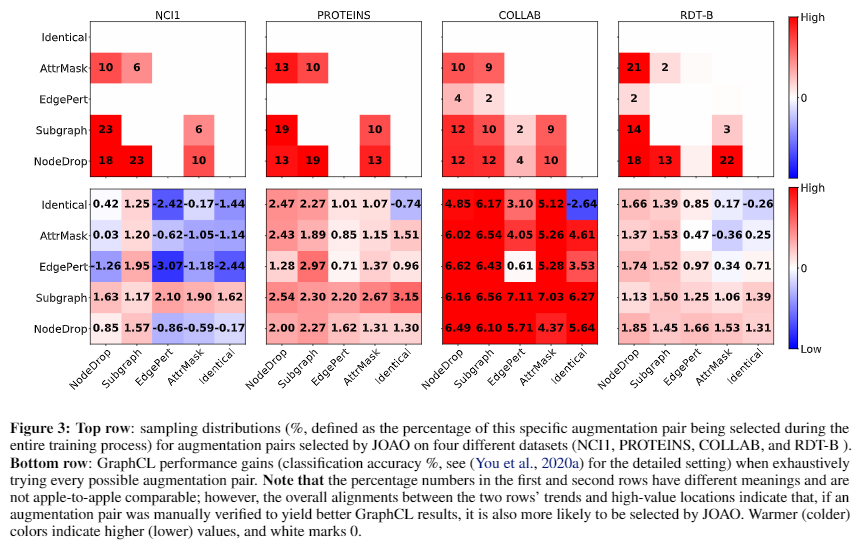
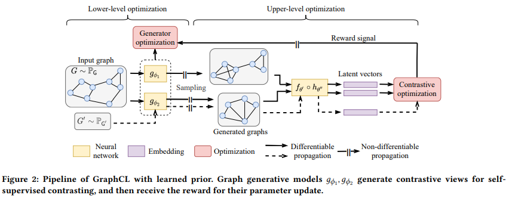

# Automate Graph Contrastive Learning Beyond Pre-Defined Augmentations

PyTorch implementations of:

**Automated selection of augmentations:** [Graph Contrastive Learning Automated](https://arxiv.org/abs/2106.07594)
[[talk]](https://recorder-v3.slideslive.com/?share=39319&s=4366fe70-48a4-4f2c-952b-2a7ca56d48bf)
[[poster]](https://yyou1996.github.io/files/icml2021_graphcl_automated_poster.pdf)
[[appendix]](https://yyou1996.github.io/files/icml2021_graphcl_automated_supplement.pdf)

Yuning You, Tianlong Chen, Yang Shen, Zhangyang Wang

In ICML 2021.

**Generating augmentations with generative models:** [Bringing Your Own View: Graph Contrastive Learning without Prefabricated Data Augmentations](https://arxiv.org/abs/2201.01702)
<!-- [[talk]](https://recorder-v3.slideslive.com/?share=39319&s=4366fe70-48a4-4f2c-952b-2a7ca56d48bf)
[[poster]](https://yyou1996.github.io/files/icml2021_graphcl_automated_poster.pdf)
[[appendix]](https://yyou1996.github.io/files/icml2021_graphcl_automated_supplement.pdf) -->

Yuning You, Tianlong Chen, Zhangyang Wang, Yang Shen

In WSDM 2022.

## Overview

In this repository, we propose a principled framework named joint augmentation selection (JOAO), to automatically, adaptively and dynamically select augmentations during [GraphCL](https://arxiv.org/abs/2010.13902) training.
Sanity check shows that the selection aligns with previous "best practices", as shown in Figure 3 of [Graph Contrastive Learning Automated](https://arxiv.org/abs/2106.07594) (ICML 2021).  Corresponding folder names are $Setting_$Dataset. 





We further propose leveraging graph generative models to directly generate augmentations (LP for Learned Priors) rather than relying on the prefabricated ones, as shown in Figure 2 of [Bringing Your Own View: Graph Contrastive Learning without Prefabricated Data Augmentations](https://arxiv.org/abs/2201.01702) (WSDM 2022).  Corresponding folder names end with LP: $Setting_$Dataset_LP.  Please note that although the study used GraphCL as the base model, leading to GraphCL-LP, the proposed LP framework is more general than that and can use other base models (such as BRGL in Appendix B).  



## Dependencies


* [torch-geometric](https://github.com/rusty1s/pytorch_geometric) >= 1.6.0
* [ogb](https://github.com/snap-stanford/ogb) == 1.2.4


## Experiments

* Semi-supervised learning [[JOAO: TU Datasets]](https://github.com/Shen-Lab/GraphCL_Automated/tree/master/semisupervised_TU) [[JOAO: OGB]](https://github.com/Shen-Lab/GraphCL_Automated/tree/master/semisupervised_OGB) [[GraphCL-LP: TU Datasets]](https://github.com/Shen-Lab/GraphCL_Automated/tree/master/semisupervised_TU_LP) [[GraphCL-LP: OGB]](https://github.com/Shen-Lab/GraphCL_Automated/tree/master/semisupervised_OGB_LP)
* Unsupervised representation learning [[JOAO: TU Datasets]](https://github.com/Shen-Lab/GraphCL_Automated/tree/master/unsupervised_TU)
* Transfer learning [[JOAO: MoleculeNet and PPI]](https://github.com/Shen-Lab/GraphCL_Automated/tree/master/transferLearning_MoleculeNet_PPI) [[GraphCL-LP: MoleculeNet and PPI]](https://github.com/Shen-Lab/GraphCL_Automated/tree/master/transferLearning_MoleculeNet_PPI_LP)

## Citation

If you use this code for you research, please cite our paper.

```
@article{you2021graph,
  title={Graph Contrastive Learning Automated},
  author={You, Yuning and Chen, Tianlong and Shen, Yang and Wang, Zhangyang},
  journal={arXiv preprint arXiv:2106.07594},
  year={2021}
}

@misc{you2022bringing,
    title={Bringing Your Own View: Graph Contrastive Learning without Prefabricated Data Augmentations},
    author={Yuning You and Tianlong Chen and Zhangyang Wang and Yang Shen},
    year={2022},
    eprint={2201.01702},
    archivePrefix={arXiv},
    primaryClass={cs.LG}
}
```
